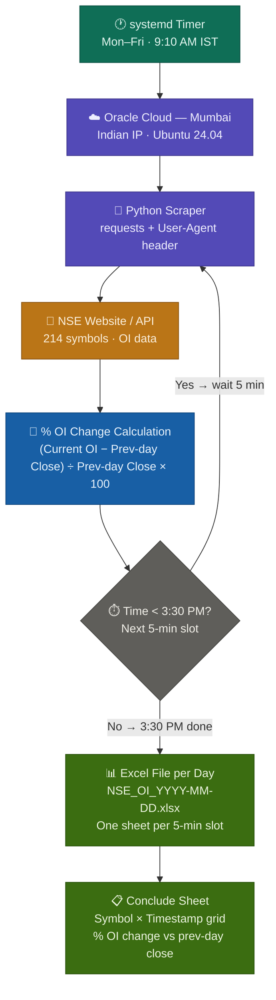

# 📊 NSE Open Interest (OI) Tracker

Live Open Interest tracker for 214 NSE symbols — scrapes data every 5 minutes 
during market hours (9:15 AM – 3:30 PM IST) and exports structured Excel reports.

## ⚙️ How It Works

- **Scraping:** Hits NSE API every 5 min with Indian IP (Oracle Cloud, Mumbai region)
- **Output:** One Excel file per day, one sheet per 5-min slot (9:15, 9:20 ... 3:30)
- **Conclude Sheet:** End-of-day summary — stock symbol vs every timestamp, 
  values = % OI change vs **previous day's closing OI** (fixed baseline, not rolling)
- **Scheduling:** systemd timer (Mon–Fri, starts 9:10 AM IST)
- **Hosting:** Oracle Cloud Always Free — VM.Standard.E2.1.Micro, Mumbai region

## 📈 % OI Change Formula% 
Baseline is fixed to previous day's close — every slot compares to the same number.

## 🛠️ Tech Stack
- **Language:** Python
- **Libraries:** Pandas, openpyxl, requests
- **Hosting:** Oracle Cloud Always Free (Mumbai — Indian IP required for NSE)
- **Scheduler:** systemd timer
- **Output:** Excel (.xlsx) with multi-sheet structure

## 📁 Output Format
NSE_OI_2026-08-19.xlsx

├── Sheet: 9.15 ← Raw OI data at 9:15 AM

├── Sheet: 9.20 ← Raw OI data at 9:20 AM

├── ...

└── Sheet: conclude ← % OI change per symbol across all timestampsChange = ((Current OI - Prev Day Close OI) / Prev Day Close OI) × 100


## ⚡ Why Oracle Cloud?
NSE blocks requests from foreign IPs (GitHub Actions US runners returned no data).
Oracle Cloud's Mumbai region provides an Indian IP — data comes through successfully.

## 🚀 Setup
```bash
git clone https://github.com/Anshbhardwaj29/nse-oi-tracker
cd nse-oi-tracker
pip install -r requirements.txt
# Configure systemd timer for 9:10 AM IST Mon-Fri
```

